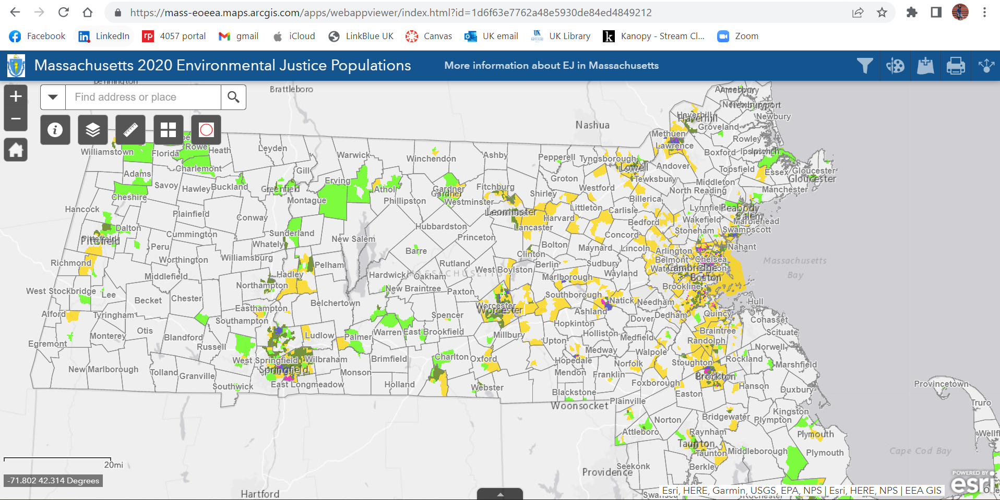
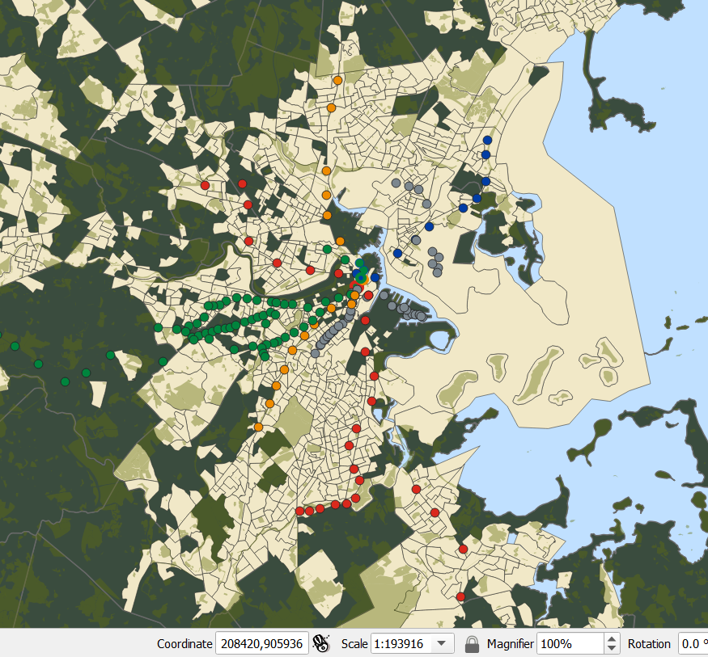
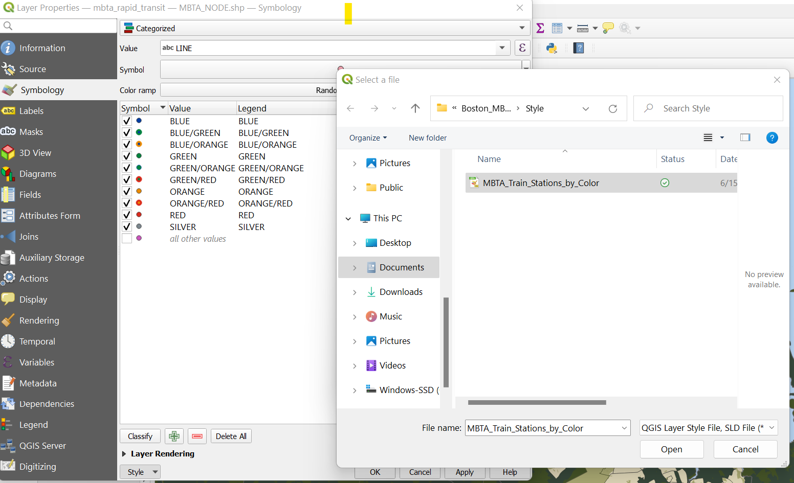
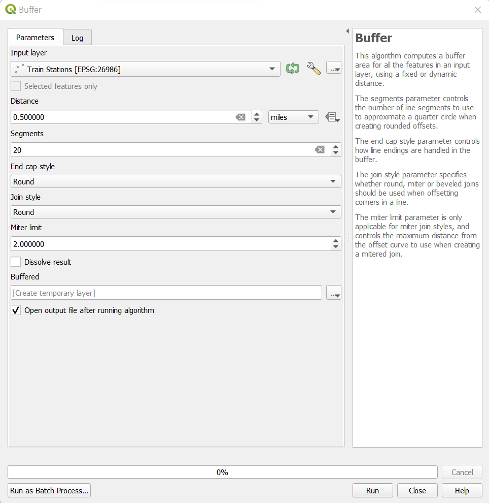
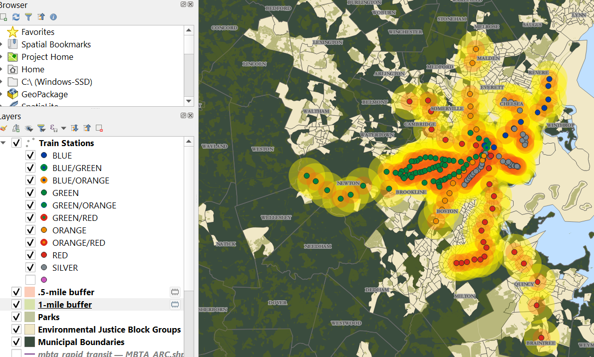
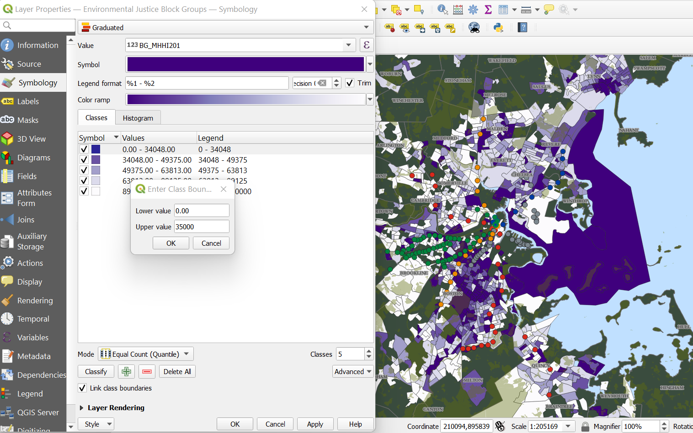
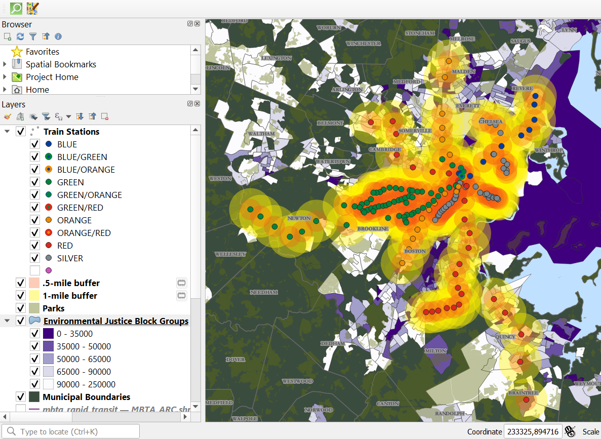
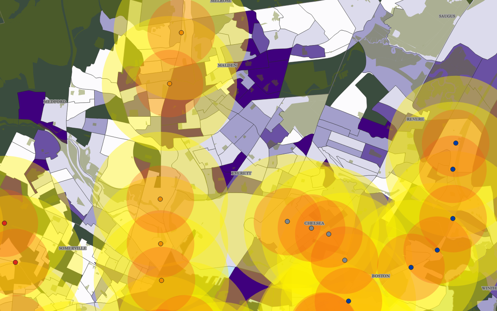
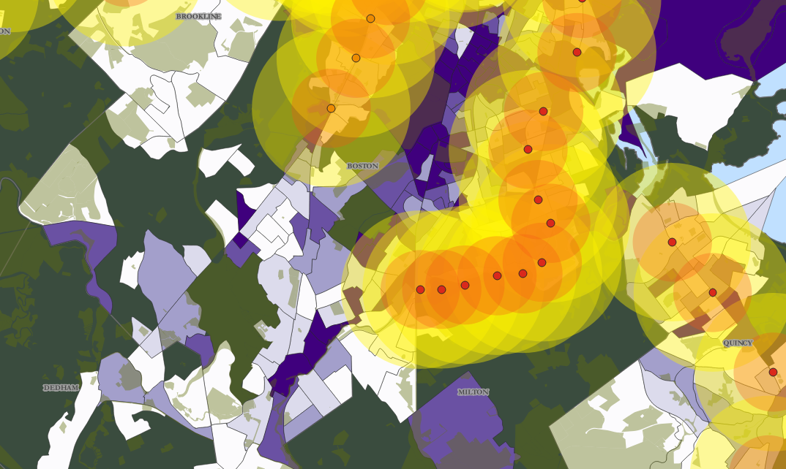

# Boston_MBTA

My final project looks at the Metro Boston Transit Authority (MBTA) and state-designated Environmental Justice communities in Massachusetts.

An Environmental Justice Community is defined by the Commonwealth of Massachusetts if one or more of the following four criteria are true:

1. The annual median household income is not more than 65 per cent of the statewide annual median household income
2. Minorities comprise 40 per cent or more of the population
3. 25 per cent or more of households lack English language proficiency
 line break 
*or*
4. Minorities comprise 25 per cent or more of the population and the annual median household income of the municipality in which the neighborhood is located does not exceed 150 per cent of the statewide annual median household income.
 
One of the benefits of using data sourced from MassGIS (Bureau of Geographic Information), is that almost all of their data and layers are available to view in an onine map. That way, I could preview the data and get a feel for what information was going to be most helpful for the project I am interested in.

  
*MassGIS Online Map View*

I first navigated to the MassGIS website to check out what data is availabe for download. You can find all the files here: https://www.mass.gov/info-details/massgis-data-layers

There are a number of zip files I dowloaded from these pages to start my map. In bottom to top order-
1. Municipalities (Political/Administrative Boundaries)
2. 2020 Environmental Justice Populations (Census Data)
3. Protected and Recreational Open Space (Conservation/Recreation)
4. MBTA Rapid Transit (Infrastructure)

Many of these zip files have multiple shapefiles in them, several of which may be useful. All the State-sourced Massachusetts data uses the Coordinate Reference System for the Massachusetts Mainand which is CRS EPSG:26986, so I set my CRS before opening any layers. For my projects, I used townssurvey_shp — TOWNSSURVEY_POLYM_GENCOAST.shp, ej2020 — EJ_2020_POLY.shp, openspace — OPENSPACE_POLY.shp, and mbta_rapid_transit — MBTA_NODE.shp. It's helpful to rename them now so they can be distinguished from the others that I don't use. I don't always remove extra layers in case they may be helpful later on.

  
*Renaming Layers*

After I've renamed the layers I'm using and masked the ones I'm not, I went on and styled them to make the project easier to read. I changed the project background to a blue water color, and the municipalities layer to a dark green with light grey boundaries. I changed the EJ Neighborhoods to a light cream color and opacity and color of the parks to a lighter green and removed the boundaries so they could be seen across the neighborhoods on the EJ layer. Last, I changed the colors of the MBTA Stations to the colors associated with their train lines. all the official hex code colors can be found here: https://en.wikipedia.org/wiki/Module:Adjacent_stations/MBTA/sandbox

  
*Map Style*

I have also saved a new style in my repo for colorizing the different train stops according to official MBTA colors.

  
*MBTA Style*

For this project I want to mainly focus on the rapid transit trains rather than buses because the bus system provides a significantly less reliable service and is dependent a far more factors (traffic, weather, road construction, etc.) than the trains. If my map is about effective accessibility, expanding train services would have a much greater impact on underserved communities than additional bus stops and routes, (in my opinion). 

Now that the map layers are in order and styled, I want to take a look at areas that are within .5 miles of any train stations, which would be about a 10-minute walk. I started with using buffers to identify what that radius looks like.

  
*adding buffers*

After changing the style, I can start to see what areas are lacking rapid-transit service, and how many of those neighborhoods are Environmental Justice Block Groups. If we extend the buffer to 1 mile, how much area is covered then?

  
*Adding Buffers*

Looking at the map now and the buffered areas, You can see gaps in service to the north in Chelsea, Everett, and Revere, West in Somerville and Medford, and South Boston going all the way towards Deadham and Quincy. 

Idealy, I would love to look at the relative population density of these areas and compare the population densities of the underserved areas. Instead, I've symbolized the Environmental Justice Block Groups on a gradient by Median Household Income to think about community needs and what neighborhoods might be in greater need of expanded service. I inverted the gradient to show areas with the lowest income as the darkest most noticable color, indicating the highest need. I then edited the ranges to round it out a bit. 

  
*Stylizing by Income Groups*

By looking at this new colorized view of the EJ Block Groups, I can see where the train stations are positioned around areas with lower median incomes. I can add back in the .5- and 1-mile buffer layers to see what high-needs areas are not within able-bodied accessibility to a rapid-transit MBTA station.

  
*adding buffers back in*

Right away 5 areas stick out to me as spots with inadequate train access - north between Malden's Orange Line and Revere's Blue Line, northwest beween Malden and Cambridge, west from Watertown to Waltham, south through Dedham as an Orange or Red Line extension, and southeast of Quincy into Weymouth. 

Though not reflected in this data, earlier this year the MBTA ceebrated the opening of the Green Line Extension. This years-long process was approved in 2017 and will provide service northward from the Lechmere stop in Cambride through that Somerville-Medford gap to the northwest of Boston. View details of the project here: https://www.mbta.com/projects/green-line-extension-glx

  
*Northern Service Gaps*

Taking a close look at that area on my map though, you can see that there are not many block groups in that gap of service that are at the lowest income level, and those that are, are just north of where the extension stops. Looking closer at some of the other gaps in service around the city, we can see several low-income areas in Everett, Malden, and Revere that are just outside of reasonable access to service. Simiarly, there are major service gaps south of Boston between the Orange and Red Lines where there are many neighborhoods in the lowest median income category, that could greatly benefit from increased access to rapid transit.

  
*Southern Service Gaps*

One thing to address about this map is the dark area east of Winthrop, where much of this EJ group is actually water but includes a bit of coast and isands with very low but highly vulnerable populations. This causes a bit of an anomoly with how to interperet this data, as many other parts of Winthrop are actually quite wealthy. The status as an Environmental Justice Population refers more to geological vulnerabilities, as much of this area would be devastated by sea-level rise or prolonged severe weather events. Additionally, many utility companies operate in this area, meaning surrounding communities may be impacted by a change in safety or function to this area, which greaty increases its vulnerability.

I've used all this information to create a web page that highlights this anaysis of the Metro Boston Area. Visit http://127.0.0.1:5500/index.html

